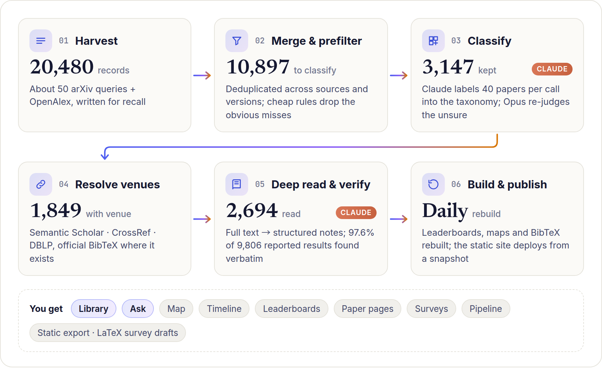

<div align="center">


# SurveyAtlas

**Living literature surveys for fast-moving research fields.**

A survey you can search, filter, ask questions to, and that rebuilds itself as new papers appear.<br>
LLM agents harvest, classify and deep-read a field's papers. SurveyAtlas serves the result as a website<br>
with a faceted library, a research map, a timeline, verified benchmark leaderboards, Q&A and LaTeX survey drafts.

[](LICENSE)
[](#quick-start)
[](#quick-start)
[](https://www.anthropic.com/claude-code)
[](#navatlas-the-worked-example)

[**Project page**](https://billzhao1030.github.io/SurveyAtlas/) · [**Live demo**](https://billzhao1030.github.io/SurveyAtlas/navatlas/) · [Quick start](#quick-start) · [Build your own atlas](#build-an-atlas-for-your-own-field) · [How it works](#how-it-works) · [**中文说明**](README.zh-CN.md)

<a href="https://billzhao1030.github.io/SurveyAtlas/#demo"></a>

<sub>12 seconds of the <a href="https://billzhao1030.github.io/SurveyAtlas/#demo">70-second video</a> · library, year range and author profile</sub>

</div>

---

## Why a website instead of a survey paper?

A survey PDF is out of date the day it is published. And now that anyone can ask an LLM to summarize a stack of papers, a summary alone is no longer the valuable part.

What stays valuable is the structured, checked view of a field that a good survey gives you:
- what belongs to the field and what does not;
- which technical routes exist and how they differ;
- which numbers can fairly be compared;
- where the open gaps are.

SurveyAtlas builds that view and keeps it current:

- **Structured.** Every paper is placed in a field-specific taxonomy (task, paradigm, setting, contribution, techniques, benchmarks), so the field can be sliced any way you like.
- **Verified.** Deep-reading agents extract each paper's reported results, check every number against the paper text, and keep subset evaluations apart from full splits.
- **Alive.** A scheduled job harvests new papers, classifies them, reads them and rebuilds the site.
- **Reusable.** One Python file describes a field. Point it at your own area and you get your own living survey.

The first public atlas, **NavAtlas**, covers vision-and-language navigation (VLN) and embodied navigation.

## What you get

| | |
|---|---|
| **Library** | Faceted search over every paper. A filter bar puts a **year range slider** (over a live histogram), **author search with a profile card** (papers, citations, co-authors, venues, years active) and a **venue picker** on top. The sidebar also filters by scope, task, paradigm, setting, contribution, industry authors, benchmark and technique. Query syntax (`task:VLN year:>=2024 venue:CVPR author:smith -exclude "exact phrase"`), seven sort orders (relevance, newest, oldest, most cited, recently added, title, first author), and export of the current selection as **BibTeX**, **CSV** or `\cite{}`. Stars, reading status and notes per paper. |
| **Ask** | Ask in plain language: *"How far behind fine-tuned methods are training-free VLN agents on R2R-CE?"* Claude answers **only from the atlas** (abstracts, deep-reading notes, reported results), cites papers as numbered links, and attaches the best reported results when you name a benchmark. Every question has a shareable link. |
| **Map** | Task × paradigm heat map. Dense cells are mature lines of work, empty cells are open questions. There is also a task × year view. Click any cell to open its papers. |
| **Timeline** | Papers per year by paradigm, per-task trend panels, and the most-cited landmark papers of each year. |
| **Benchmarks** | Leaderboards built from the deep-reading notes. They separate full split from subset, zero-shot from trained, and open from closed weights, and flag privileged information. Each number carries its evidence (the table or sentence it came from), and an LLM judge checks the protocol so you only compare like with like. |
| **Paper pages** | TL;DR, a structured deep read (problem, motivation, key idea, insight, method, setting, results, limitations, lineage), verified numbers, official BibTeX, and links to arXiv, PDF, DOI, Semantic Scholar, DBLP and code. |
| **Surveys** | Survey outlines whose sections are live queries over the library. A LaTeX workspace (`./atlas survey`) writes per-section evidence packs, results tables and figures, and builds a PDF draft. |
| **Pipeline** | Full transparency: the harvest funnel, every query and its yield, and every excluded paper with the reason, so missing papers are easy to find. |
| **Static export** | `./atlas export` writes a read-only copy for GitHub Pages or any web host. This repo deploys its [project page](https://billzhao1030.github.io/SurveyAtlas/) and the [live NavAtlas](https://billzhao1030.github.io/SurveyAtlas/navatlas/) that way. |

<table>
<tr>
<td width="50%"><p align="center"><b>Ask</b>: cited answers from the atlas only</p></td>
<td width="50%"><p align="center"><b>Map</b>: task × paradigm, click any cell</p></td>
</tr>
<tr>
<td width="50%"><p align="center"><b>Benchmarks</b>: comparable results only</p></td>
<td width="50%"><p align="center"><b>Paper pages</b>: deep-reading notes and BibTeX</p></td>
</tr>
</table>

## NavAtlas, the worked example

NavAtlas is a living survey of **embodied navigation**:
- instruction-following VLN (R2R, RxR, VLN-CE), goal-oriented VLN (REVERIE, SOON) and dialog navigation (CVDN);
- ObjectNav, instance and image goals, PointNav;
- multi-goal and lifelong navigation (GOAT-Bench, IVLN);
- audio-visual, social and question-answering navigation, and generalist navigation models.

Methods are grouped by paradigm, from task-specific learning and large-scale pretraining, through fine-tuned foundation models, to zero-shot modular pipelines and agentic navigators.

| Snapshot (October 2026) | |
|---|---|
| Records harvested from arXiv + OpenAlex | 20,480 |
| Papers kept after LLM classification | **3,147** (2,212 core, 481 adjacent, 454 aerial) |
| Papers deep-read from full text | **2,694** |
| Reported benchmark results extracted | **9,806** from 1,861 papers, 97.6% found verbatim in the paper text |
| Papers with a resolved venue | 1,849 (official BibTeX via DBLP / CrossRef where available) |
| BibTeX entries | 3,147 |

The whole atlas is defined in one file, [`atlases/navatlas/atlas.py`](atlases/navatlas/atlas.py): queries, taxonomy, classifier rules, benchmark protocols and landmark papers. Its data ships as a compact snapshot (`atlases/navatlas/snapshot/`, 23 MB), so a fresh clone rebuilds the site **without any API calls**.

## Quick start

**Requirements:**
- Python 3.9+ and `requests`. Nothing else is needed to browse.
- Optional: [Claude Code](https://www.anthropic.com/claude-code), logged in once (`claude`). You need it for Ask, for adding or classifying papers, for deep reading and for building new atlases.

```bash
git clone https://github.com/billzhao1030/SurveyAtlas.git
cd SurveyAtlas
./install.sh --start          # checks deps, restores NavAtlas from its snapshot, starts the site
```

Open **http://localhost:8668**. That's it.

<details>
<summary><b>What <code>install.sh</code> does, and options</b></summary>

- Checks Python and installs `requests` if missing, then checks for the `claude` CLI and `crontab`.
- Writes a git-ignored `local.json` holding your contact e-mail, which is used for the polite API pools of OpenAlex and CrossRef.
- Links the bundled Claude Code skill into `~/.claude`, so that you can tell Claude Code *"build a literature atlas for X"* (`--no-claude` skips this).
- Restores every atlas that has a snapshot and builds it.
- `--start` starts the hub in the background, and `--cron` installs the scheduled update.

The hub binds to `127.0.0.1`. To open it to your LAN, use `./atlas start --host 0.0.0.0` (or set `"host"` in `local.json`). Other devices then need the site password (initially `0000`, change it in Settings).
</details>

**Next steps:**

```bash
./atlas ask navatlas "Which zero-shot methods lead HM3D ObjectNav, and what do they rely on?"   # Q&A in the terminal
./atlas add navatlas 2507.05240          # add a paper you just saw (about 1 minute)
./atlas update navatlas                  # harvest + classify everything new since the last run
./atlas cron install --daily             # keep it fresh every day at 05:13
./atlas export navatlas ./site           # static read-only copy, e.g. for GitHub Pages
```

## Build an atlas for your own field

An atlas is one Python file plus data caches. The fastest way is to let Claude draft that file.

```bash
./atlas new llmagents --title "AgentAtlas" --subtitle "LLM Agent Literature Atlas" --field "LLM agents"
./atlas draft llmagents --brief "Papers on LLM-based agents since 2023: tool use, planning, memory, multi-agent
  systems, agent harnesses and benchmarks. Exclude pure prompting papers and chatbots."
#   → Claude writes atlases/llmagents/atlas.py: queries, taxonomy, classifier rules, landmarks
./atlas check llmagents && ./atlas ready llmagents     # validate, then unlock harvesting
./atlas update llmagents --full                        # harvest → classify → venues → build
./atlas recall llmagents                               # are the landmark papers all in?
./atlas read llmagents                                 # optional: deep reading + leaderboards
```

You can do the same from the website: open **Atlases** (top-left logo), click **New atlas**, write a brief, then **Draft with Claude → Check → Mark ready → Run first build**. In Claude Code you can also just say *"build a literature atlas for LLM agents"*. The bundled skill (`claude/skills/literature-atlas/`) walks Claude through the [playbook](claude/skills/literature-atlas/playbook.md), including the API pitfalls we already hit.

<details>
<summary><b>Anatomy of <code>atlases/&lt;id&gt;/atlas.py</code></b></summary>

| Block | What it defines |
|---|---|
| `META` | Title, field, display options, which models classify and read |
| `ARXIV_QUERIES`, `OPENALEX_QUERIES` | Recall-first search queries. Precision comes from the classifier |
| `RELEVANCE_RE`, `OA_STRICT_RE`, … | Cheap rule prefilter before any LLM call |
| `SCOPES`, `TASKS`, `SETTINGS`, `PARADIGMS`, `CONTRIBS`, `TRAITS`, `BENCHMARKS` | The taxonomy, which is the single source of truth for the classifier and the website |
| `CLASSIFY_ROLE`, `CLASSIFY_RULES` | The instructions the LLM labels papers with |
| `BENCH_PROTOCOLS`, `SUBSET_PROTOCOLS`, `BENCH_VARIANTS` | What counts as a standard protocol, so leaderboards compare like with like |
| `LANDMARKS` | Papers that must be in the library (`./atlas recall` checks them) |
| `UI` | Map row groups, quick filters, Ask examples, live survey outlines |

Hand corrections go in `overrides.json`, and extra arXiv ids in `seeds.txt`. Engine and website code never contain anything field-specific.
</details>

## How it works

<picture>
  <source media="(prefers-color-scheme: dark)" srcset="docs/img/pipeline-dark.png">
  
</picture>

| Stage | Command | What happens |
|---|---|---|
| Harvest | `harvest`, `harvest-oa` | arXiv (with 429 backoff) and OpenAlex queries. Results are cached and fetched incrementally |
| Merge | `merge` | Deduplicate across sources and versions, then apply rule prefilters (year, category, relevance regex) |
| Classify | `classify` | Headless Claude (Sonnet) labels 40 papers per call. A second Opus pass re-judges low-confidence papers. Labels are cached, so a paper is never paid for twice |
| Resolve | `resolve` | Semantic Scholar (venue, DOI, citations), arXiv comments ("Accepted to …"), DBLP and CrossRef for official BibTeX |
| Read | `read` | Full text (arXiv LaTeX source, then PDF, then abstract) is condensed and read by Claude into the schema in `read_system.md`. Every reported number is searched for verbatim in the text |
| Check | `comparable`, `variants`, `audit` | An LLM judge flags protocol deviations, benchmark versions are separated (e.g. HM3D ObjectNav v1 vs v2), and outliers are audited |
| Build | `build` | Writes `public/*.json` and `atlas.bib` for the hub |
| Serve | `start`, `serve`, `export` | One stdlib web server for every atlas, or a static copy |

**Measured cost (NavAtlas, Claude subscription via Claude Code):**
- First build: about 2 hours. That is harvest about 30 min, classifying 10.9k papers about 35 min, Opus re-judging about 40 min, and venues about 10 min.
- Weekly update: about 5 minutes.
- Classification and reading go through `claude -p`, so they run on your Claude Code login. No API key is needed.

## Configuration

| Where | What |
|---|---|
| `atlases/<id>/atlas.py` | Everything about a field (see above) |
| `atlases/<id>/overrides.json` | Hand fixes per paper: scope, paradigm, tasks, venue, name |
| `atlases/<id>/read_system.md` | The deep-reading prompt for this field: schema, metric names, split names |
| `settings.json` | Default atlas, theme, background, accent and density. Also editable from the gear icon |
| `local.json` (git-ignored) | `contact_email`, `host`, `read_window` (e.g. `"23:30-08:00"` to read only at night), `fulltext_cache` (folders with full texts you already have), `openalex_api_key`, `snapshot` (what a committed snapshot leaves out), admin key and site password hash |
| Environment | `ATLAS_PORT`, `ATLAS_HOST`, `ATLAS_OPEN=1` (no site password), `ATLAS_ADMIN_LAN=1`, `ATLAS_ASK_OPEN=1` (let every viewer use Ask), `ATLAS_CONTACT` |

<details>
<summary><b>CLI reference</b></summary>

```text
./atlas list                                   atlases, sizes, build dates
./atlas new <id> --title T [--subtitle S] [--field F] [--description D]
./atlas draft <id> --brief "…"                 Claude drafts atlas.py from a brief
./atlas check <id> · ./atlas ready <id>        validate · validate and unlock
./atlas update <id>|--all [--full] [--prescreen haiku]
./atlas add <id> <arXiv id or URL>...          add specific papers now
./atlas build <id>                             rebuild public/ from data/
./atlas <step> <id> [args]                     harvest | harvest-oa | merge | classify | resolve | build |
                                               digest | recall | read | comparable | audit | variants | affil
./atlas ask <id> "question" [--no-llm]         Q&A with citations
./atlas export <id> <dir> [--keep-surveys]     static read-only site
./atlas survey <id> <sid> init|assign|packs|bib|pdf|status
./atlas start | stop | status · ./atlas serve [--port 8668] [--host H]
./atlas snapshot <id> [--with-raw] · ./atlas restore <id> [--force]
./atlas backup [--no-push]                     snapshot every atlas, commit the snapshots, push
./atlas cron install [--daily] [--publish] | remove | show
./atlas meta | rename | delete | admin-key | password
```
</details>

## Keep a public atlas alive

1. A machine with Claude Code runs `./atlas cron install --daily --publish`. Every day it harvests, classifies and reads new papers, then commits and pushes the updated snapshot.
2. Publish the static site from the snapshot (no API calls) in either of two ways:
   - **GitHub Pages of the repo**: [`.github/workflows/pages.yml`](.github/workflows/pages.yml) restores the atlas and deploys the project page with the atlas under `/<id>/`. Enable **Settings → Pages → Source: GitHub Actions**, then run the workflow, or add a `push` trigger so every snapshot push redeploys.
   - **Any static host or personal homepage**: `./atlas export navatlas <folder> --project-page` writes the landing page to `<folder>` and the atlas to `<folder>/navatlas/`. The project page linked above is served this way from a Jekyll homepage.

## How it compares

| | Self-hosted, open source | Field taxonomy | Updates itself | Benchmark leaderboards | Q&A with citations | Survey drafting |
|---|:-:|:-:|:-:|:-:|:-:|:-:|
| **SurveyAtlas** | ✓ | ✓ (LLM-labelled) | ✓ | ✓ (verified, protocol-aware) | ✓ | ✓ (LaTeX) |
| Awesome-lists | ✓ | by hand | by hand | — | — | — |
| Papers with Code (closed in 2025) | — | partial | ✓ | ✓ | — | — |
| Connected Papers, Litmaps, ResearchRabbit | — | — | ✓ | — | — | — |
| Elicit, Consensus, Undermind | — | — | ✓ | — | ✓ | — |
| PaperQA2, OpenScholar | ✓ | — | — | — | ✓ | — |
| AutoSurvey, SurveyX, STORM | ✓ | — | — (one shot) | — | — | ✓ |

## Good to know

- **Labels and notes are machine-generated.** Low-confidence labels are flagged, every reported number carries its evidence, and you can fix anything in `overrides.json`. Still, check the paper before you cite a number.
- **Ask answers only from the atlas.** It says so when the atlas does not answer a question, but its retrieval is keyword-based (BM25 over titles, abstracts and notes), so phrase questions with the field's terms.
- **Data sources.** Metadata comes from arXiv, OpenAlex (CC0), Semantic Scholar, CrossRef and DBLP. Abstracts remain the authors' and publishers'. The code is MIT-licensed.
- **No account or API key is needed to browse.** The LLM steps use your own Claude Code login (`claude -p`).

## Roadmap

- [ ] More public atlases: embodied AI agents, LLM agents and harnesses
- [ ] Citation-graph view (built-on and compared-with edges are already extracted)
- [ ] `pip install surveyatlas` and a Docker image
- [ ] Optional Anthropic API key backend for Ask on hosted sites
- [ ] A "what's new" page and RSS feed on the site (today: `./atlas digest <id>` writes a Markdown digest)

Contributions are welcome. Corrections to NavAtlas labels (`overrides.json`) and new atlases are especially useful.

## Citation

If SurveyAtlas or NavAtlas helps your work, please cite the repository (see [`CITATION.cff`](CITATION.cff)):

```bibtex
@software{surveyatlas2026,
  title  = {SurveyAtlas: Living Literature Surveys for Fast-Moving Research Fields},
  author = {Zhao, Xunyi},
  year   = {2026},
  url    = {https://github.com/billzhao1030/SurveyAtlas}
}
```

## License

[MIT](LICENSE)
