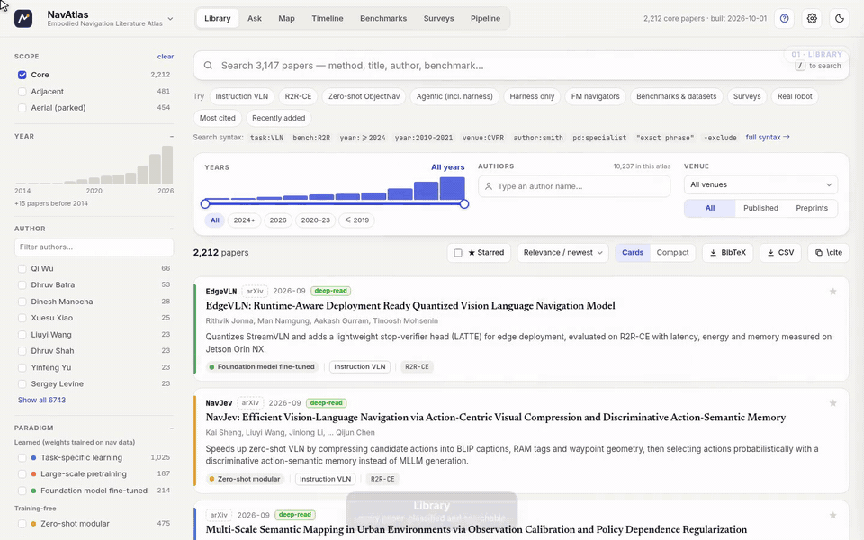
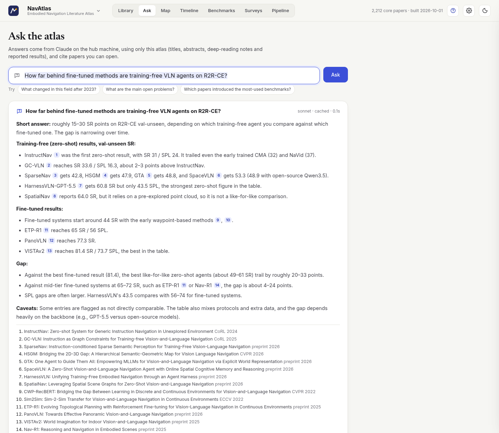
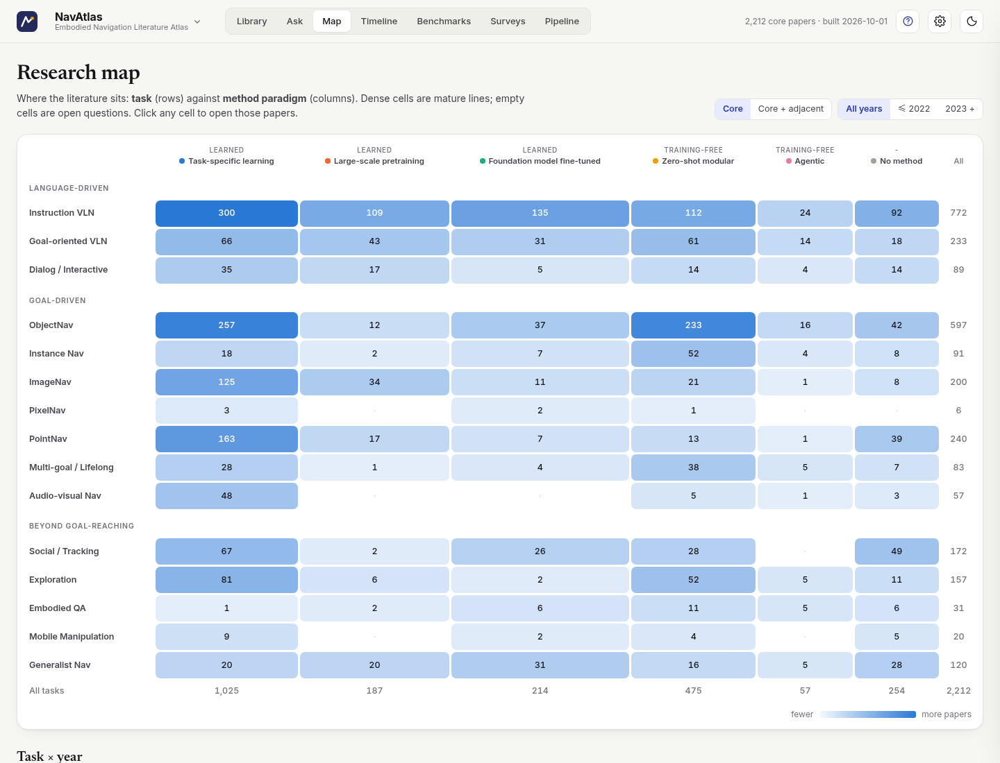
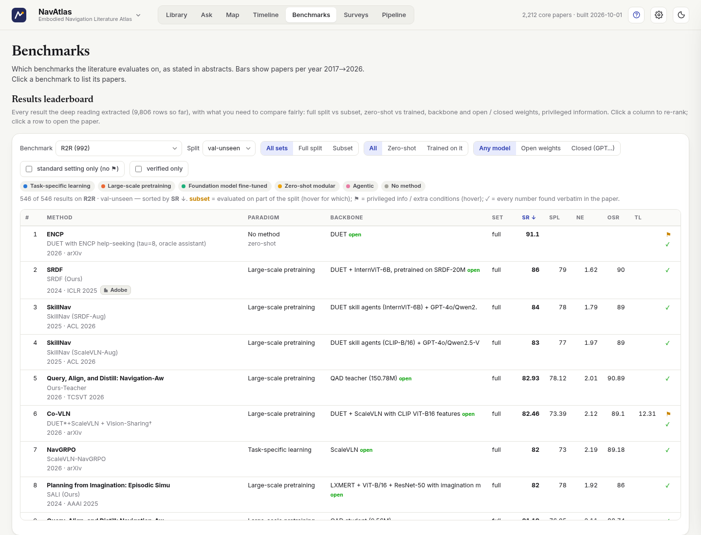
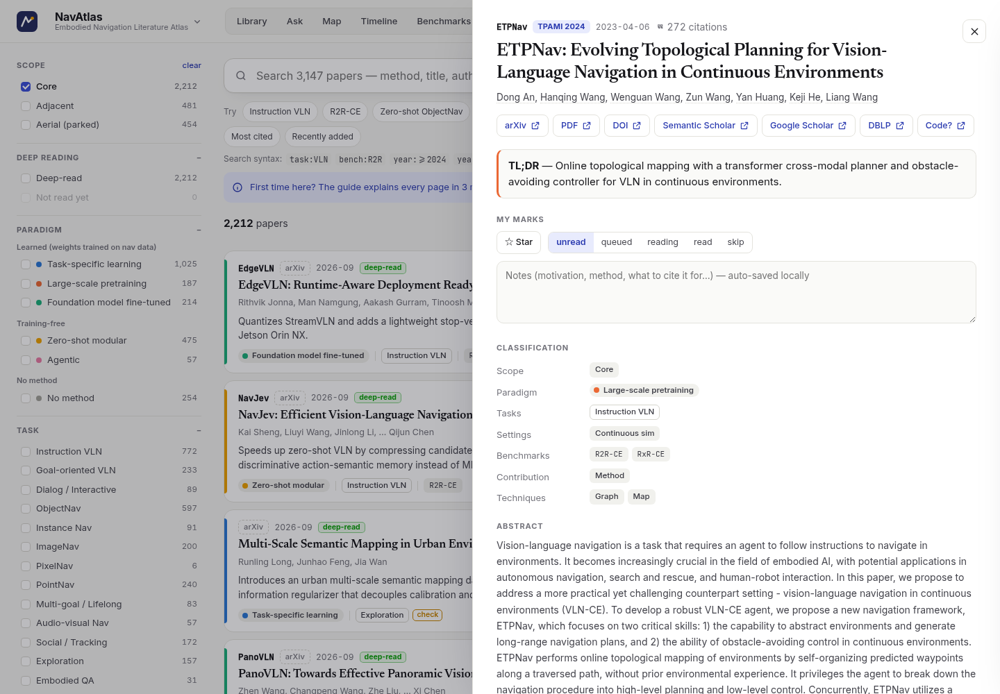
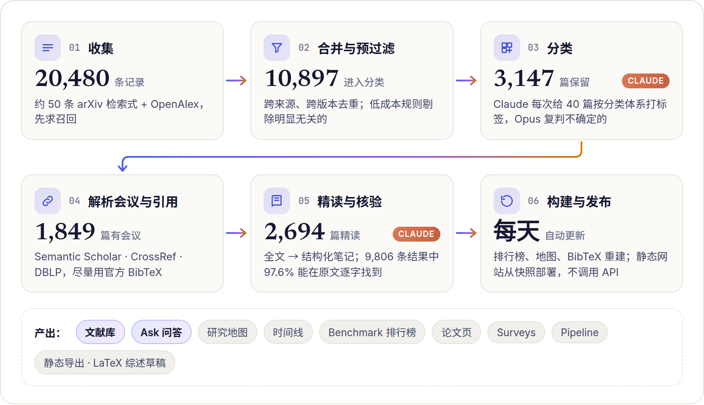

<div align="center">


# SurveyAtlas

**面向快速发展领域的「活的」文献综述。**

这份综述可以检索、可以筛选、可以直接提问，有新论文出来还会自己重建。<br>
LLM 智能体负责收集、分类、精读一个领域的论文，SurveyAtlas 把结果做成一个网站：<br>
分面文献库、研究地图、时间线、经过核验的 benchmark 排行榜、问答，以及 LaTeX 综述草稿。

[](LICENSE)
[](#快速上手)
[](#快速上手)
[](https://www.anthropic.com/claude-code)
[](#navatlas示例图谱)

[**项目主页**](https://billzhao1030.github.io/SurveyAtlas/) · [**在线演示**](https://billzhao1030.github.io/SurveyAtlas/navatlas/) · [快速上手](#快速上手) · [为自己的领域建一个图谱](#为自己的领域建一个图谱) · [工作原理](#工作原理) · [**English**](README.md)

<a href="https://billzhao1030.github.io/SurveyAtlas/#demo"></a>

<sub>70 秒<a href="https://billzhao1030.github.io/SurveyAtlas/#demo">完整视频</a>中的 12 秒：文献库、年份区间筛选、作者画像</sub>

</div>

---

## 为什么做成网站，而不是再写一篇综述？

一篇综述 PDF 发表的那天就开始过时。现在人人都能让 LLM 总结一堆论文，光有总结已经不值钱了。

一篇好综述真正有价值的，是它对一个领域给出的结构化、经过核实的视图：
- 哪些工作属于这个领域，哪些不属于；
- 有哪几条技术路线，彼此有什么区别；
- 哪些数字可以公平地放在一起比较；
- 研究空白在哪里。

SurveyAtlas 把这个视图做出来，并且让它一直保持最新：

- **结构化**：每篇论文都放进一套领域专属的分类体系（任务、范式、设定、贡献类型、技术、benchmark），领域可以按任意维度切片。
- **可核验**：精读智能体抽取每篇论文报告的结果，逐个数字回到原文核对，并把子集评测和全量 split 分开。
- **活的**：定时任务抓取新论文，完成分类和精读，然后重建网站。
- **可复用**：一个 Python 文件描述一个领域，换成你自己的方向，就得到你自己的「活综述」。

第一个公开的图谱 **NavAtlas** 覆盖视觉-语言导航（VLN）和具身导航。

## 功能一览

| | |
|---|---|
| **Library（文献库）** | 对全部论文做分面检索。顶部的筛选栏有**年份区间滑块**（叠在实时直方图上）、**作者搜索和作者画像卡**（论文数、引用、合作者、会议、活跃年份）以及**会议选择器**；侧栏还能按范围、任务、范式、设定、贡献类型、工业界作者、benchmark、技术筛选。支持查询语法（`task:VLN year:>=2024 venue:CVPR author:smith -exclude "exact phrase"`）和 7 种排序（相关度、最新、最早、引用最多、最近加入、标题、第一作者）。当前结果可以导出为 **BibTeX**、**CSV** 或 `\cite{}`。每篇论文可以加星、标阅读状态、写笔记。 |
| **Ask（提问）** | 直接用自然语言提问，例如 *「R2R-CE 上 training-free 的 VLN 智能体比微调方法落后多少？」*。Claude **只根据图谱内容**作答（摘要、精读笔记、报告的结果），用编号链接引用论文；问题里提到 benchmark 时，会附上该 benchmark 上最好的报告结果。每个问题都有可分享的链接。 |
| **Map（研究地图）** | 任务 × 范式热力图：颜色深的格子是成熟方向，空格子是还没人做的问题。另有任务 × 年份视图。点任何格子都能打开对应论文。 |
| **Timeline（时间线）** | 每年各范式的论文数、各任务的增长趋势，以及每年引用最多的地标论文。 |
| **Benchmarks（结果大表）** | 由精读笔记构建的排行榜：区分全量 split 和子集、zero-shot 和训练过的方法、开源和闭源权重，并标出用了特权信息的结果。每个数字都附有出处（来自哪张表或哪句话），协议由 LLM 评审检查，保证只比较可比的结果。 |
| **论文页** | TL;DR、结构化精读（问题、动机、核心想法、洞见、方法、设定、结果、局限、谱系）、核验过的数字、官方 BibTeX，以及 arXiv、PDF、DOI、Semantic Scholar、DBLP、代码链接。 |
| **Surveys（综述）** | 综述提纲，每一节都是对文献库的实时查询。LaTeX 工作区（`./atlas survey`）会生成分节证据包、结果表格和图，并编译出 PDF 草稿。 |
| **Pipeline（流水线）** | 完全透明：收集漏斗、每条检索式的产出、每篇被排除的论文和排除原因，方便排查漏掉的论文。 |
| **静态导出** | `./atlas export` 生成只读副本，可以放到 GitHub Pages 或任何静态托管上。本仓库的[项目主页](https://billzhao1030.github.io/SurveyAtlas/)和[在线 NavAtlas](https://billzhao1030.github.io/SurveyAtlas/navatlas/) 就是这样部署的。 |

<table>
<tr>
<td width="50%"><p align="center"><b>Ask</b>：只根据图谱作答，并附引用</p></td>
<td width="50%"><p align="center"><b>Map</b>：任务 × 范式，点格子看论文</p></td>
</tr>
<tr>
<td width="50%"><p align="center"><b>Benchmarks</b>：只比较可比的结果</p></td>
<td width="50%"><p align="center"><b>论文页</b>：精读笔记与 BibTeX</p></td>
</tr>
</table>

## NavAtlas：示例图谱

NavAtlas 是一份关于**具身导航**的「活综述」，覆盖：
- 指令跟随 VLN（R2R、RxR、VLN-CE）、目标导向 VLN（REVERIE、SOON）、对话导航（CVDN）；
- ObjectNav、实例/图像目标导航、PointNav；
- 多目标和终身导航（GOAT-Bench、IVLN）；
- 视听导航、社交导航、问答式导航，以及通用导航模型。

方法按范式组织：从任务专用学习、大规模预训练，到微调的基础模型，再到 zero-shot 模块化流水线和 agentic 导航智能体。

| 快照（2026 年 10 月） | |
|---|---|
| 从 arXiv + OpenAlex 收集的记录 | 20,480 |
| LLM 分类后保留的论文 | **3,147**（core 2,212，adjacent 481，aerial 454） |
| 基于全文精读的论文 | **2,694** |
| 抽取的 benchmark 结果 | **9,806** 条，来自 1,861 篇论文，其中 97.6% 能在原文中逐字找到 |
| 解析出会议/期刊的论文 | 1,849（尽量使用 DBLP / CrossRef 的官方 BibTeX） |
| BibTeX 条目 | 3,147 |

整个图谱由一个文件定义：[`atlases/navatlas/atlas.py`](atlases/navatlas/atlas.py)，里面是检索式、分类体系、分类规则、benchmark 协议和地标论文。数据以压缩快照的形式随仓库发布（`atlases/navatlas/snapshot/`，23 MB），所以新克隆的仓库**不需要任何 API 调用**就能重建网站。

## 快速上手

**环境要求：**
- Python 3.9+ 和 `requests`。只浏览的话，别的都不需要。
- 可选：[Claude Code](https://www.anthropic.com/claude-code)，运行一次 `claude` 登录即可。Ask、添加或分类论文、精读、新建图谱都要用到它。

```bash
git clone https://github.com/billzhao1030/SurveyAtlas.git
cd SurveyAtlas
./install.sh --start          # 检查依赖，从快照恢复 NavAtlas，启动网站
```

打开 **http://localhost:8668**，就可以用了。

<details>
<summary><b><code>install.sh</code> 做了什么，以及可选参数</b></summary>

- 检查 Python，缺 `requests` 就自动安装；再检查 `claude` CLI 和 `crontab`。
- 生成不进 git 的 `local.json`，里面存联系邮箱，用于 OpenAlex / CrossRef 的 polite pool。
- 把自带的 Claude Code skill 链接到 `~/.claude`，之后可以直接对 Claude Code 说「给 X 建一个文献图谱」（`--no-claude` 跳过这一步）。
- 恢复并构建所有带快照的图谱。
- `--start` 在后台启动网站，`--cron` 安装定时更新。

网站默认只监听 `127.0.0.1`。想让局域网访问，用 `./atlas start --host 0.0.0.0`，或在 `local.json` 里设 `"host"`。其他设备需要输入站点密码（初始为 `0000`，可以在设置里修改）。
</details>

**接下来可以：**

```bash
./atlas ask navatlas "HM3D ObjectNav 上领先的 zero-shot 方法有哪些？它们依赖什么？"   # 在终端里提问
./atlas add navatlas 2507.05240          # 刚看到的论文，马上收进来（约 1 分钟）
./atlas update navatlas                  # 收集并分类上次运行以来的新论文
./atlas cron install --daily             # 每天 05:13 自动更新
./atlas export navatlas ./site           # 导出静态只读网站，例如放到 GitHub Pages
```

## 为自己的领域建一个图谱

一个图谱就是一个 Python 文件加上数据缓存。最快的办法是让 Claude 起草这个文件：

```bash
./atlas new llmagents --title "AgentAtlas" --subtitle "LLM Agent Literature Atlas" --field "LLM agents"
./atlas draft llmagents --brief "Papers on LLM-based agents since 2023: tool use, planning, memory, multi-agent
  systems, agent harnesses and benchmarks. Exclude pure prompting papers and chatbots."
#   → Claude 写出 atlases/llmagents/atlas.py：检索式、分类体系、分类规则、地标论文
./atlas check llmagents && ./atlas ready llmagents     # 校验，然后解锁收集
./atlas update llmagents --full                        # 收集 → 分类 → 会议 → 构建
./atlas recall llmagents                               # 地标论文是否都在库里？
./atlas read llmagents                                 # 可选：精读 + 结果大表
```

网页上也能完成同样的流程：点左上角 logo 进入 **Atlases**，点 **New atlas**，写一段简介，然后依次点 **Draft with Claude → Check → Mark ready → Run first build**。也可以直接在 Claude Code 里说「给 LLM agent 建一个文献图谱」，自带的 skill（`claude/skills/literature-atlas/`）会引导 Claude 按 [playbook](claude/skills/literature-atlas/playbook.md) 操作，其中记录了我们已经踩过的 API 坑。

<details>
<summary><b><code>atlases/&lt;id&gt;/atlas.py</code> 的结构</b></summary>

| 部分 | 定义的内容 |
|---|---|
| `META` | 标题、领域、显示选项，以及分类和精读用哪个模型 |
| `ARXIV_QUERIES`、`OPENALEX_QUERIES` | 先求召回的检索式，精度交给分类器 |
| `RELEVANCE_RE`、`OA_STRICT_RE` 等 | 调用 LLM 之前的低成本规则预过滤 |
| `SCOPES`、`TASKS`、`SETTINGS`、`PARADIGMS`、`CONTRIBS`、`TRAITS`、`BENCHMARKS` | 分类体系，分类器和网站都以它为唯一依据 |
| `CLASSIFY_ROLE`、`CLASSIFY_RULES` | 给 LLM 打标签用的指令 |
| `BENCH_PROTOCOLS`、`SUBSET_PROTOCOLS`、`BENCH_VARIANTS` | 什么算标准协议，保证排行榜只比较可比的结果 |
| `LANDMARKS` | 必须在库里的论文（由 `./atlas recall` 检查） |
| `UI` | 地图的行分组、快捷筛选、Ask 示例问题、实时综述提纲 |

人工修正写在 `overrides.json`，额外的 arXiv id 写在 `seeds.txt`。引擎和网站代码里不包含任何领域相关的内容。
</details>

## 工作原理

<picture>
  <source media="(prefers-color-scheme: dark)" srcset="docs/img/pipeline-zh-dark.png">
  
</picture>

| 阶段 | 命令 | 做什么 |
|---|---|---|
| 收集 | `harvest`、`harvest-oa` | arXiv（遇到 429 自动退避）和 OpenAlex 检索；结果有缓存，按增量抓取 |
| 合并 | `merge` | 跨来源、跨版本去重，然后做规则预过滤（年份、分类、相关性正则） |
| 分类 | `classify` | headless Claude（Sonnet）每次给 40 篇打标签，低置信度的再用 Opus 复判；标签有缓存，同一篇不会花两次钱 |
| 解析 | `resolve` | Semantic Scholar（会议、DOI、引用数）、arXiv comment（"Accepted to …"）、DBLP 和 CrossRef（官方 BibTeX） |
| 精读 | `read` | 全文（优先 arXiv LaTeX 源码，其次 PDF，最后摘要）压缩后由 Claude 按 `read_system.md` 的格式精读，每个报告的数字都会回原文逐字查找 |
| 核查 | `comparable`、`variants`、`audit` | LLM 评审标出协议偏差；区分 benchmark 版本（比如 HM3D ObjectNav v1 和 v2）；审查异常值 |
| 构建 | `build` | 为网站生成 `public/*.json` 和 `atlas.bib` |
| 服务 | `start`、`serve`、`export` | 一个标准库实现的 web 服务器承载所有图谱，也可以导出静态副本 |

**实测成本（NavAtlas，通过 Claude Code 使用 Claude 订阅）：**
- 首次构建约 2 小时：收集约 30 分钟，分类 1.09 万篇约 35 分钟，Opus 复判约 40 分钟，会议解析约 10 分钟。
- 每周增量更新约 5 分钟。
- 分类和精读都通过 `claude -p` 完成，用的是你自己的 Claude Code 登录，不需要 API key。

## 配置

| 位置 | 内容 |
|---|---|
| `atlases/<id>/atlas.py` | 关于一个领域的全部定义（见上） |
| `atlases/<id>/overrides.json` | 按论文的人工修正：scope、范式、任务、会议、名称 |
| `atlases/<id>/read_system.md` | 这个领域的精读提示词：输出格式、指标名、split 名 |
| `settings.json` | 默认图谱、主题、背景、强调色、卡片密度，也可以在网页齿轮里改 |
| `local.json`（不进 git） | `contact_email`、`host`、`read_window`（例如 `"23:30-08:00"`，只在夜里精读）、`fulltext_cache`（你已有全文的文件夹）、`openalex_api_key`、`snapshot`（提交快照时排除哪些内容），以及管理密钥和站点密码哈希 |
| 环境变量 | `ATLAS_PORT`、`ATLAS_HOST`、`ATLAS_OPEN=1`（不设站点密码）、`ATLAS_ADMIN_LAN=1`、`ATLAS_ASK_OPEN=1`（所有访客都能用 Ask）、`ATLAS_CONTACT` |

<details>
<summary><b>命令速查</b></summary>

```text
./atlas list                                   列出图谱、规模、构建日期
./atlas new <id> --title T [--subtitle S] [--field F] [--description D]
./atlas draft <id> --brief "…"                 由 Claude 根据简介起草 atlas.py
./atlas check <id> · ./atlas ready <id>        校验 · 校验并解锁
./atlas update <id>|--all [--full] [--prescreen haiku]
./atlas add <id> <arXiv id 或 URL>...          立即加入指定论文
./atlas build <id>                             用 data/ 重建 public/
./atlas <step> <id> [args]                     harvest | harvest-oa | merge | classify | resolve | build |
                                               digest | recall | read | comparable | audit | variants | affil
./atlas ask <id> "问题" [--no-llm]             带引用的问答
./atlas export <id> <dir> [--keep-surveys]     导出静态只读网站
./atlas survey <id> <sid> init|assign|packs|bib|pdf|status
./atlas start | stop | status · ./atlas serve [--port 8668] [--host H]
./atlas snapshot <id> [--with-raw] · ./atlas restore <id> [--force]
./atlas backup [--no-push]                     给所有图谱打快照，提交快照并推送
./atlas cron install [--daily] [--publish] | remove | show
./atlas meta | rename | delete | admin-key | password
```
</details>

## 让公开的图谱一直「活着」

1. 一台装了 Claude Code 的机器运行 `./atlas cron install --daily --publish`。它每天收集、分类、精读新论文，然后提交并推送更新后的快照。
2. 用快照发布静态网站（不调用任何 API），有两种方式：
   - **仓库自己的 GitHub Pages**：[`.github/workflows/pages.yml`](.github/workflows/pages.yml) 会恢复图谱，把项目主页放在根目录、图谱放在 `/<id>/` 下部署。在 **Settings → Pages → Source** 里选 **GitHub Actions** 后手动运行这个 workflow，或者加一个 `push` 触发器，让每次推送快照都自动重新部署。
   - **任意静态托管或个人主页**：`./atlas export navatlas <目录> --project-page` 会把项目主页写到 `<目录>`，把图谱写到 `<目录>/navatlas/`。上面链接的项目主页就是这样放在一个 Jekyll 个人主页里的。

## 和其他工具的比较

| | 可自托管、开源 | 领域分类体系 | 自动更新 | Benchmark 排行榜 | 带引用的问答 | 综述起草 |
|---|:-:|:-:|:-:|:-:|:-:|:-:|
| **SurveyAtlas** | ✓ | ✓（LLM 标注） | ✓ | ✓（核验过、区分协议） | ✓ | ✓（LaTeX） |
| Awesome 列表 | ✓ | 手工 | 手工 | — | — | — |
| Papers with Code（2025 年已关闭） | — | 部分 | ✓ | ✓ | — | — |
| Connected Papers、Litmaps、ResearchRabbit | — | — | ✓ | — | — | — |
| Elicit、Consensus、Undermind | — | — | ✓ | — | ✓ | — |
| PaperQA2、OpenScholar | ✓ | — | — | — | ✓ | — |
| AutoSurvey、SurveyX、STORM | ✓ | — | —（一次性生成） | — | — | ✓ |

## 需要注意

- **标签和笔记由机器生成。** 低置信度的标签会被标出，每个报告的数字都带有出处，任何内容都可以在 `overrides.json` 里修正。即便如此，引用某个数字之前还是请回原论文确认。
- **Ask 只根据图谱作答。** 图谱里找不到答案时它会明说，不会编造。不过它的检索是基于关键词的（在标题、摘要和笔记上做 BM25），提问时请尽量使用领域术语。
- **数据来源。** 元数据来自 arXiv、OpenAlex（CC0）、Semantic Scholar、CrossRef 和 DBLP；摘要的版权归作者和出版方。代码采用 MIT 许可证。
- **浏览不需要账号或 API key。** LLM 相关步骤使用你自己的 Claude Code 登录（`claude -p`）。

## 路线图

- [ ] 更多公开图谱：具身 AI 智能体、LLM 智能体与 harness
- [ ] 引用关系图视图（「基于谁」和「与谁比较」的关系已经抽取好了）
- [ ] `pip install surveyatlas` 和 Docker 镜像
- [ ] 可选的 Anthropic API key 后端，让托管的网站也能用 Ask
- [ ] 网站上的「最新论文」页面和 RSS（目前可以用 `./atlas digest <id>` 生成 Markdown 摘要）

欢迎贡献！尤其欢迎修正 NavAtlas 的标签（`overrides.json`）和贡献新的图谱。

## 引用

如果 SurveyAtlas 或 NavAtlas 对你的工作有帮助，请引用本仓库（见 [`CITATION.cff`](CITATION.cff)）：

```bibtex
@software{surveyatlas2026,
  title  = {SurveyAtlas: Living Literature Surveys for Fast-Moving Research Fields},
  author = {Zhao, Xunyi},
  year   = {2026},
  url    = {https://github.com/billzhao1030/SurveyAtlas}
}
```

## 许可证

[MIT](LICENSE)
